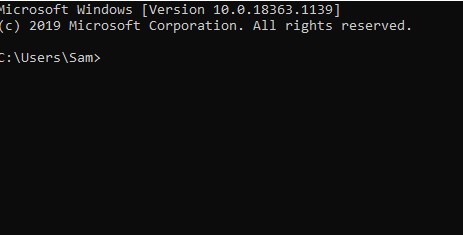
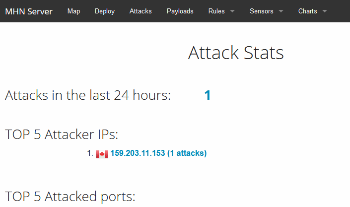

# Honeypot Assignment

**Time spent:** **5** hours spent in total

**Objective:** Create a honeynet using MHN-Admin. Present your findings as if you were requested to give a brief report of the current state of Internet security. Assume that your audience is a current employer who is questioning why the company should allocate anymore resources to the IT security team.

### MHN-Admin Deployment (Required)

I used GCP to deploy mhn-admin

### Dionaea Honeypot Deployment (Required)

Dionaea is intended to act as a fake target for cyberattacks, attracting attackers like a honeypot in order to better defend against such attacks

### Database Backup (Required) 

mhn-admin utilizes mongodb, session.json holds data of all of the attacks that our honeypot attracted.

*Be sure to upload session.json directly to this GitHub repo/branch in order to get full credit.*

## Notes

I was unable to deploy dionaea despite trying for hours, most of my time was spent with that. I didn't understand that the deploy page had given me the wrong ip address and had to create a different honeypot to get it to work. I only got one attack but all things considered I was happy to get just that.
